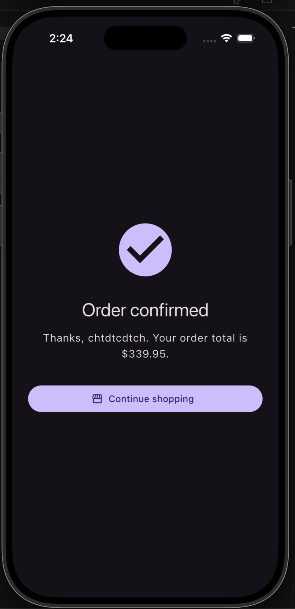
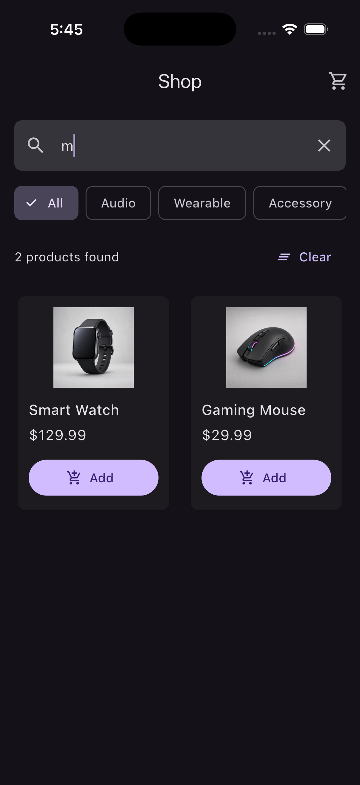
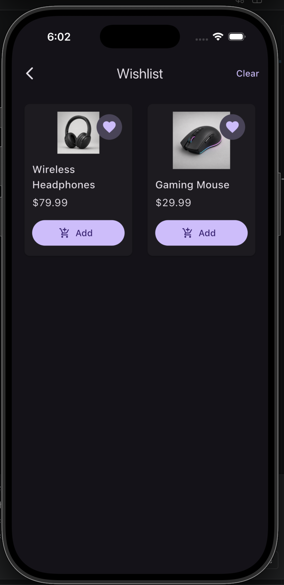
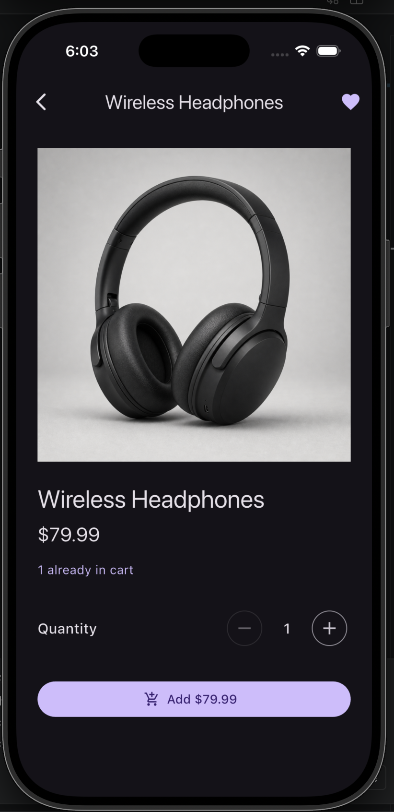
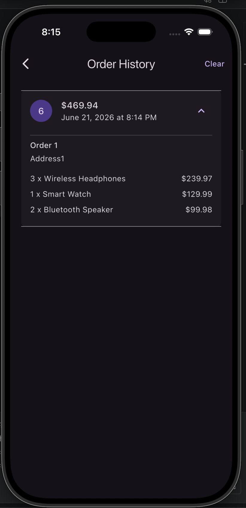
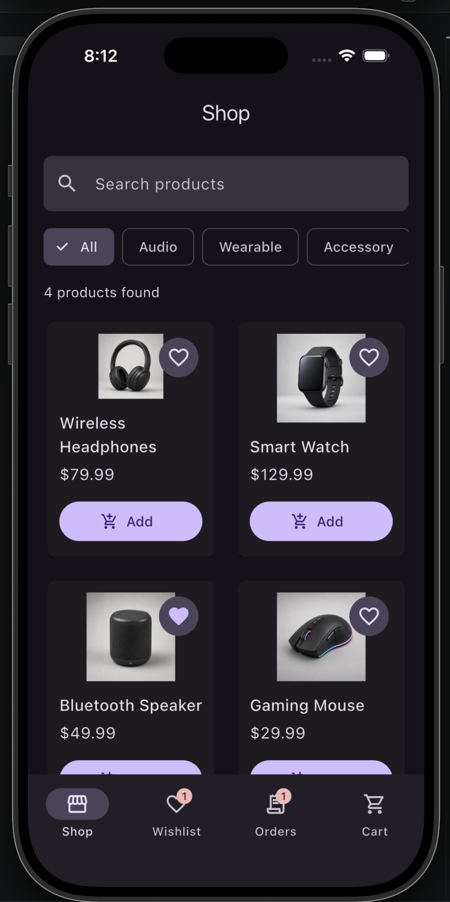

# Shopping App

A Flutter shopping app built as a learning project for app development, UI structure, navigation, and state management with the `provider` package.

The goal of this project is to build a realistic shopping flow step by step while keeping the codebase lean enough to understand clearly.

## Current Progress

The app currently includes:

- Product browsing with searchable, filterable product cards
- Firestore product catalog with brand, rating, stock, and description data
- Remote product image URLs with bundled asset fallbacks
- Stock-aware quantity controls and checkout validation
- Transactional checkout through a callable Cloud Function
- Razorpay Test Mode checkout with stock reservations and order statuses
- Order details with a backend-driven demo fulfillment timeline
- Emulator-tested Firestore rules and concurrent stock reservation
- Auth-gated main app with bottom navigation for Shop, Wishlist, Orders, Cart, and Account
- Product detail pages with quantity selection and add-to-cart behavior
- Cart, Razorpay checkout, payment verification, and order confirmation flow
- Wishlist/favorites experience
- User-scoped cart, wishlist, and order history backed by Cloud Firestore
- Separate sign-in/create-account flow and signed-in account profile UI
- Firestore-backed delivery profile with checkout prefill
- Centralized Material theme foundation with persisted local theme preference
- Local recent search history with `SharedPreferences`
- Local product and screenshot assets

## Learning Focus

This project is currently focused on understanding state management with Provider.

Current state-management decisions:

- `Cart` is shared app state and is exposed with `ChangeNotifierProvider`.
- `ProductFilter` is shared catalog state and is exposed with `ChangeNotifierProvider`.
- `ProductCatalog` owns the Firestore product subscription and its loading, empty, and error states.
- `Wishlist` is shared app state and is exposed with `ChangeNotifierProvider`.
- `OrderHistory` is shared app state and is exposed with `ChangeNotifierProvider`.
- `AuthController` owns Firebase auth/profile state and is exposed with `ChangeNotifierProvider`.
- `AppPreferences` owns local app preferences and persists them with `SharedPreferences`.
- `AuthGate` shows the auth flow before the main shopping shell when no user is signed in.
- Cart, wishlist, and order history bind to the signed-in user's Firebase UID.
- Delivery profile fields live on the signed-in user's Firestore document.
- Cart mutations live in `Cart`, such as `add`, `remove`, `setQuantity`, and `clear`.
- `Cart` rejects quantities above the latest known product stock.
- Search and category mutations live in `ProductFilter`, such as `setQuery`, `setCategory`, and `clear`.
- Favorite mutations live in `Wishlist`, such as `toggle`, `remove`, and `clear`.
- The `placeOrder` Cloud Function atomically validates stock, reserves inventory, creates a `pendingPayment` order, and clears purchased cart items.
- Razorpay orders are created on the backend with credentials stored in Firebase Secret Manager.
- The `verifyRazorpayPayment` Cloud Function verifies Razorpay's HMAC signature before changing an order to paid.
- The `resolvePayment` Cloud Function handles failed or cancelled payments and restores reserved stock.
- A scheduled function expires abandoned payment reservations and restores their stock.
- Checkout refreshes the catalog from the Firestore server and validates every cart quantity before creating an order.
- Wishlist stores product IDs instead of full product objects so product details still come from the catalog.
- Shop and Wishlist resolve products from the same Firestore-backed catalog.
- Product cards and details use one `ProductImage` widget for remote loading and local fallback behavior.
- Cart, wishlist, and order history are persisted under the signed-in user in Firestore.
- Theme mode and recent searches are stored locally on the device because they are app preferences, not user data.
- Temporary screen state stays local to the screen.
- The search text controller stays local to the search field because it is a UI controller, not app data.
- Product detail quantity is local state because it only matters before the item is added to the cart.
- Shared stock remains read-only in the customer app; authoritative inventory decrement runs in the trusted Cloud Function.
- Callable checkout uses server-side cart quantities and catalog prices instead of trusting values supplied by the Flutter client.
- Order status and payment resolution are backend-owned; the Flutter app cannot mark an order paid directly.
- Checkout form controllers are local state because they only belong to the checkout form.
- `context.read` is used for actions that update state.
- `context.select` is used when a widget only needs a specific value from Provider.
- `Consumer` is used when a larger section needs to rebuild from cart changes.

## Screenshots

Screenshots will be added as the app reaches meaningful feature milestones. Since the app is still in early development, screenshots will be used from this point forward to show how the app progresses over time.

Current milestone screenshots:

| Product Grid                                                                                                                 | Product Detail                                                                                                                 |
| ---------------------------------------------------------------------------------------------------------------------------- | ------------------------------------------------------------------------------------------------------------------------------ |
|  |  |

| Cart                                                                                                                 | Checkout                                                                                                                 |
| -------------------------------------------------------------------------------------------------------------------- | ------------------------------------------------------------------------------------------------------------------------ |
|  |  |

| Order Success                                                                      |
| ---------------------------------------------------------------------------------- |
|  |

| Search and Filtering                                                                         | Wishlist                                                                 |
| -------------------------------------------------------------------------------------------- | ------------------------------------------------------------------------ |
|  |  |

| Product Detail Favorite                                                                                |
| ------------------------------------------------------------------------------------------------------ |
|  |

| Order History                                                                      |
| ---------------------------------------------------------------------------------- |
|  |

| Clean Navigation                                                                         |
| ---------------------------------------------------------------------------------------- |
|  |

Suggested location for future screenshots:

```text
assets/screenshots/
```

## Project Structure

```text
lib/
  main.dart
  app/       # Bootstrap, dependency composition, and app-wide flow
  core/      # Shared theme and formatting utilities
  features/  # Feature-first domain, data, and presentation code

assets/
  data/
  products/
  screenshots/

functions/
  index.js
  order_utils.js
  test/
```

The app uses a pragmatic feature-first layered architecture with
Provider-based presentation controllers. See
[Architecture Restructuring Report](docs/architecture_restructuring.md) for
the decisions, dependency rules, migration process, tradeoffs, and
interview-ready explanation.

## Git Workflow

The project uses:

- `main` for meaningful stable updates
- `dev` for active development

Current development work is committed directly to `dev`. When `dev` reaches a meaningful upgrade point, it can be merged into `main`.

## Running The App

Install dependencies:

```bash
flutter pub get
```

Run on an iOS simulator:

```bash
flutter run
```

Analyze the project:

```bash
flutter analyze
```

Run Flutter tests:

```bash
flutter test
```

Run backend tests:

```bash
cd functions
npm test
```

The Firestore security and checkout-concurrency test commands, trust
boundaries, and remaining production risks are documented in the
[Security and Testing Report](docs/security_and_testing.md).

## Firebase Setup

Firebase email/password authentication is wired in the app.
Cloud Firestore is used for the shared product catalog and user-scoped cart,
wishlist, and order history data.
Cloud Functions provides the authenticated `placeOrder` checkout endpoint.

The iOS Firebase app is configured with:

```text
Bundle ID: com.example.shoppingApp
Config file: ios/Runner/GoogleService-Info.plist
```

Email/Password sign-in must be enabled in the Firebase Authentication console.
Cloud Firestore must also be enabled for the Firebase project.

User data is stored under:

```text
users/{uid}/cartItems/{productId}
users/{uid}/wishlistItems/{productId}
users/{uid}/orders/{orderId}
```

Shared product data is stored under:

```text
products/{productId}
```

Each product can include an optional HTTPS image URL:

```text
imageUrl: "https://..."
```

When `imageUrl` is missing, still loading, or fails, the app displays the
bundled `imageAsset` instead. This keeps the catalog usable while remote media
is being configured.

The bundled `assets/data/products_seed.json` file remains reference data for
the sample catalog. Catalog imports belong in separate administrator tooling,
not in the customer app, because shoppers must never be able to overwrite
prices or inventory.

Product documents are readable by signed-in users but not writable by the
shopping app:

```text
match /products/{productId} {
  allow read: if request.auth != null;
  allow write: if false;
}
```

The version-controlled `firestore.rules` file additionally prevents clients
from creating, updating, or deleting order documents. The Admin SDK inside the
checkout and payment functions performs those trusted writes.

### Cloud Functions

The checkout and Razorpay Test Mode backend lives in `functions/` and uses the
Node.js 22 runtime. Payment reservations expire after 15 minutes; the scheduled
cleanup checks for abandoned reservations every 15 minutes.

Install and verify it:

```bash
cd functions
npm install
npm run check
npm test
```

Deploy the Firestore rules and callable function:

```bash
firebase login
firebase use shopping-app-3caf5
firebase functions:secrets:set RAZORPAY_KEY_ID
firebase functions:secrets:set RAZORPAY_KEY_SECRET
firebase deploy --only firestore,functions
```

Razorpay's Key ID and Key Secret are stored only in Firebase Secret Manager.
They must not be committed to the Flutter app or repository. Test Mode uses
simulated transactions; accepting real payments requires separate Live Mode
credentials and production payment safeguards such as webhook handling.

The Firebase CLI must be signed in with a Google account that has deployment
access to the `shopping-app-3caf5` project.

### Firebase Storage

Cloud Storage currently requires the Firebase project to use the Blaze plan.
After creating the default bucket:

1. Upload the four bundled product images.
2. Copy each file's download URL into the appropriate `imageUrl` entries in
   `assets/data/products_seed.json`.
3. Update the corresponding Firestore product documents through trusted
   administrator tooling.

The current sample catalog already contains the four configured download URLs
and reuses them across its twelve products.

Product images are public catalog media, while client uploads remain disabled:

```text
service firebase.storage {
  match /b/{bucket}/o {
    match /products/{productImage=**} {
      allow read: if true;
      allow write: if false;
    }
  }
}
```

Delivery profile fields are stored directly on:

```text
users/{uid}
```

Android Firebase setup is not wired yet because the provided Android Firebase app uses:

```text
Package name: com.example.shoppingApp
```

The current Android application ID is `com.example.shopping_app`.
