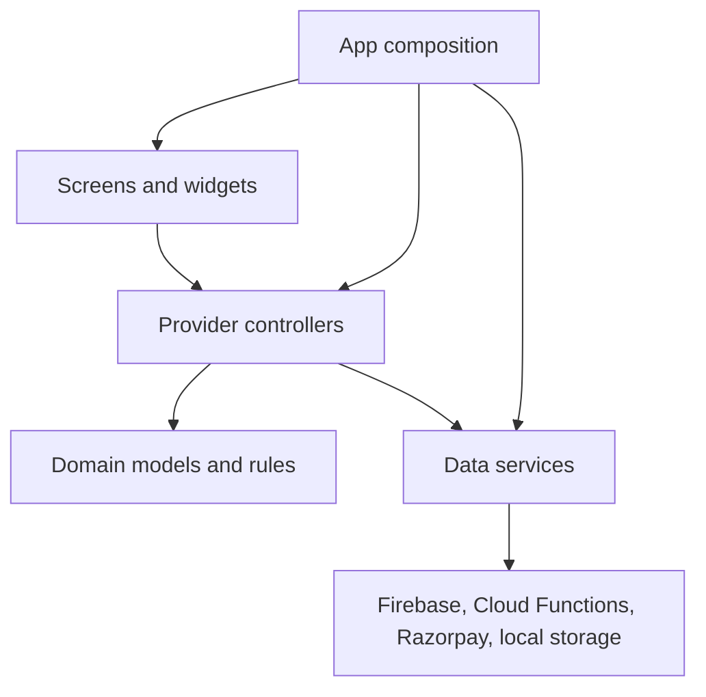
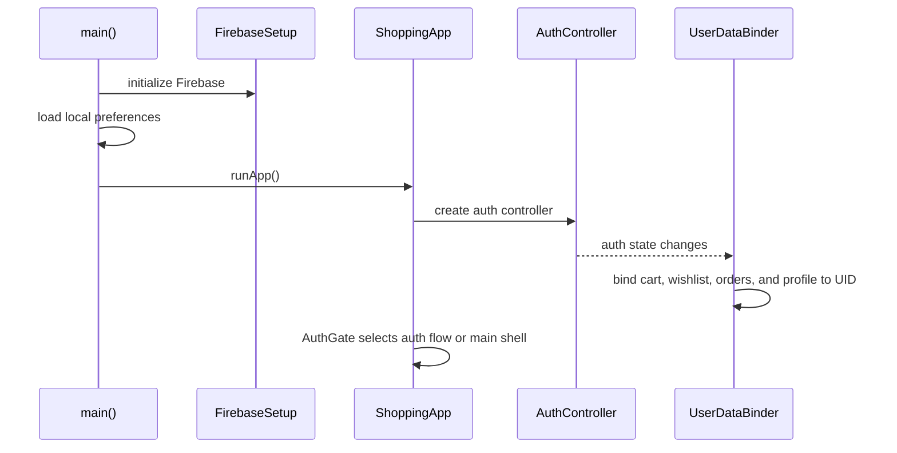

# Architecture Restructuring Report

## Executive Summary

The application started with a type-first layered structure:

```text
lib/
  models/
  providers/
  screens/
  services/
  widgets/
```

That structure was easy to understand while the app was small. As catalog,
authentication, cart, checkout, payments, orders, profiles, and settings were
added, a single feature became spread across several unrelated top-level
folders. Finding or changing one workflow required jumping around the project.

The codebase was restructured into a **feature-first layered architecture**.
Provider remains the state-management library, and the existing behavior was
preserved.

The result is best described as:

> A pragmatic, feature-first layered Flutter architecture with
> Provider-based presentation controllers.

It is MVVM-inspired, but it is not strict MVVM or strict Clean Architecture.

## Why Restructure Now?

Architecture should solve an observed problem, not predict every possible
future requirement. The original structure was suitable when the app had only
a few screens and models. It became less suitable when:

- one feature touched many top-level folders;
- `main.dart` owned startup, dependency creation, authentication routing, and
  user-data binding;
- shared folders grew without communicating feature ownership;
- adding another feature increased the chance of accidental coupling;
- interview explanations required describing file types instead of business
  capabilities.

Restructuring before adding more order and catalog features reduces the cost of
future changes while the project is still small enough to migrate safely.

## Architecture Goals

The restructuring had five concrete goals:

1. Make feature ownership visible from the directory tree.
2. Keep UI, state, and feature models close together.
3. Give application-wide composition and startup logic a clear home.
4. Keep genuinely shared code small and deliberate.
5. Preserve behavior and keep Provider so architecture learning is not mixed
   with an unnecessary state-management migration.

## Resulting Structure

```text
lib/
  main.dart

  app/
    bootstrap/
      firebase_setup.dart
    presentation/
      auth_gate.dart
      user_data_binder.dart
    shopping_app.dart

  core/
    theme/
    utils/

  features/
    auth/
      presentation/
    cart/
      domain/
      presentation/
    catalog/
      domain/
      presentation/
    checkout/
      data/
      domain/
      presentation/
    navigation/
      presentation/
    orders/
      domain/
      presentation/
    profile/
      domain/
      presentation/
    settings/
      presentation/
    wishlist/
      presentation/
```

Not every feature has every layer. Empty layers were not created merely for
symmetry. A layer is added when the feature has code that belongs there.

## Layer Responsibilities

### `app`

The `app` layer owns application-wide policy and composition:

- initializing Firebase;
- constructing root providers and services;
- selecting the theme;
- deciding whether the auth flow or main app is shown;
- binding user-scoped controllers when authentication changes.

`main.dart` is now only an entry point. It initializes dependencies that must
be ready before rendering and starts `ShoppingApp`.

### `core`

`core` contains code that is genuinely shared across unrelated features:

- the Material theme;
- money formatting;
- date formatting.

Feature-specific helpers do not belong in `core`. This prevents it from
becoming a second miscellaneous folder.

### `features`

Each feature owns the code needed to implement one business capability.

Examples:

- `catalog` owns products, filtering, search, product cards, and detail views;
- `cart` owns cart items, cart state, and the cart screen;
- `checkout` owns payment models, backend-facing services, and payment screens;
- `orders` owns order models, order history state, and order-history UI;
- `profile` owns delivery/profile data and account screens.

### `domain`

The domain layer contains business-shaped models and rules that are meaningful
without Flutter widgets.

Examples include `Product`, `CartItem`, `Order`, `PaymentMethod`, and
`UserProfile`.

### `data`

The data layer contains explicit backend integration services where the
workflow benefits from a dedicated boundary. Checkout and payment use this
layer because they coordinate Cloud Functions, Firestore, Razorpay, payment
verification, and stock reservations.

Some smaller controllers still contain straightforward Firestore subscription
code. This is an intentional intermediate tradeoff, documented under
"Intentional Compromises."

### `presentation`

The presentation layer contains:

- screens and reusable feature widgets;
- Provider `ChangeNotifier` controllers;
- UI state and user actions.

Controllers expose state in forms the widgets can render and notify listeners
when that state changes. Temporary widget-only state remains inside widgets.

## Dependency Flow

The intended dependency direction is:



Practical dependency rules:

1. Widgets may depend on controllers and domain models.
2. Controllers may depend on domain models and data services.
3. Data services may translate between external APIs and domain models.
4. Domain models must not import Flutter widgets or feature presentation code.
5. Features may use another feature's public model, controller, screen, or
   widget when the user workflow genuinely crosses feature boundaries.
6. The `app` layer is the composition root and is allowed to know concrete
   implementations.
7. `core` must not depend on a feature.

Package imports are used for project files. Cross-feature dependencies are
therefore explicit:

```dart
import 'package:shopping_app/features/cart/domain/models/cart_item.dart';
```

This is more readable and stable than long relative paths such as:

```dart
import '../../../../cart/domain/models/cart_item.dart';
```

## Provider's Role

Provider is a dependency-access and rebuild mechanism. It is not the
architecture itself.

The architecture defines where responsibilities belong. Provider makes
controllers and services available to widgets and rebuilds only the UI that
listens to changed state.

Examples:

- `context.read<T>()` performs an action without subscribing;
- `context.watch<T>()` rebuilds when the controller changes;
- `context.select<T, R>()` listens to one selected value;
- `ChangeNotifierProvider` owns presentation controllers;
- plain `Provider` exposes stateless services.

The app does not need Bloc or Riverpod merely because it is growing. A
state-management migration should happen only if Provider causes a concrete
problem that those tools solve.

## Application Startup Flow



Moving this flow out of `main.dart` has two advantages:

- startup responsibilities can be understood independently;
- future navigation or dependency-injection changes do not require editing the
  application entry point.

## Feature Interaction Example: Checkout

Checkout crosses several feature boundaries:

```text
CheckoutScreen
  -> reads Cart
  -> reads ProductCatalog for current stock
  -> reads UserProfileController for delivery data
  -> calls CheckoutService
  -> opens PaymentScreen
  -> calls PaymentService
  -> backend verifies payment and updates Order
```

These dependencies are acceptable because checkout is an orchestration
feature. It coordinates existing capabilities rather than duplicating their
state.

The important trust boundary remains unchanged:

- the Flutter app gathers user intent;
- Cloud Functions validate prices, quantities, authentication, and stock;
- Razorpay secrets and signature verification stay on the backend;
- Firestore listeners return authoritative order and inventory updates.

## Migration Strategy

The restructuring was intentionally behavior-preserving:

1. Audit the existing file tree and imports.
2. Identify feature ownership from actual dependencies.
3. Create the feature-first directory structure.
4. Move one business capability at a time.
5. Replace fragile relative imports with explicit package imports.
6. Extract app startup, auth gating, and user-data binding from `main.dart`.
7. Format the project.
8. Run static analysis and automated tests.

This strategy separates architecture movement from feature development. If a
regression appears, it is easier to locate because business behavior was not
supposed to change.

## Decisions We Deliberately Did Not Make

### No state-management rewrite

Changing both architecture and state management in one migration would
increase risk and make it unclear which change caused a regression.

### No mandatory layer in every feature

A settings feature backed only by `SharedPreferences` does not need the same
number of files as payment processing. Consistency is useful; empty ceremony is
not.

### No generic base repository

Catalog, cart, profile, and payment operations have different semantics. A
generic CRUD repository would hide those semantics and provide little value.

### No use-case class for every method

Use cases are valuable when business workflows are complex or reused. Wrapping
every `toggleFavorite` or `setTheme` call in a one-method class would add
navigation cost without reducing complexity.

## Intentional Compromises

This is not strict Clean Architecture. Several Provider controllers still
contain simple Firestore subscription and persistence code.

That is acceptable at the current scale because:

- the code is short and feature-local;
- the backend technology is already an explicit product decision;
- checkout and payments, where trust and complexity are higher, already have
  dedicated services;
- introducing repository interfaces everywhere immediately would create more
  files than useful isolation.

Repositories should be extracted when one of these triggers appears:

- a controller becomes difficult to test without Firebase;
- the same data source is used by multiple controllers;
- offline and remote sources must be coordinated;
- Firestore mapping becomes substantial;
- a backend implementation may realistically change.

This is a conscious boundary, not an accidental omission.

## Testing Strategy After Restructuring

Testing should follow the architecture:

- domain tests verify calculations and state rules;
- controller tests verify state transitions and error handling;
- service tests verify request/response mapping;
- widget tests verify important user interactions;
- backend tests verify payment, stock, and order invariants.

The highest-risk existing flows remain checkout, stock reservation, payment
verification, and inventory restoration. Architecture work is complete only
when static analysis and existing automated tests still pass.

## Interview Explanation

### Short version

> The app initially used a simple type-based structure with global folders for
> screens, providers, models, and services. That worked early on, but as the
> product grew, each feature became scattered across the codebase. I migrated
> it to a feature-first layered architecture while keeping Provider. Each
> business capability now owns its domain models and presentation code, the
> app layer owns dependency composition and authentication gating, and shared
> theme/utilities live in a deliberately small core. I migrated incrementally,
> changed imports without changing behavior, and validated the result with
> formatting, static analysis, and tests.

### Why not full Clean Architecture?

> I wanted boundaries that reduced current complexity, not abstractions added
> for appearance. Complex backend workflows such as checkout and payments have
> dedicated services, while small feature-local Firestore subscriptions remain
> in their Provider controllers. I documented concrete triggers for extracting
> repositories later. That keeps the architecture extensible without making a
> learning project unnecessarily ceremonial.

### Why keep Provider?

> Architecture and state management are separate concerns. Provider was still
> handling dependency access and UI rebuilds well, so changing it during a
> structural migration would have increased risk without solving a demonstrated
> problem. The new feature boundaries would also make a future state-management
> migration easier because it could happen one feature at a time.

## Lessons Learned

1. A good architecture can evolve; the first structure does not need to be the
   final structure.
2. Refactor when the cost of navigation and coupling becomes visible.
3. Grouping by business capability scales better than grouping only by file
   type.
4. State-management libraries do not replace architectural boundaries.
5. The composition root should be explicit and small.
6. Shared code should earn its place in `core`.
7. Behavior-preserving migrations should be separate from new feature work.
8. More abstraction is not automatically more architecture.

